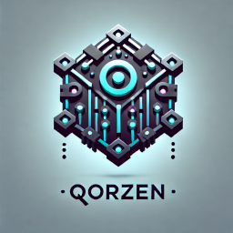

# Qorzen

A **microkernel-based platform** that provides a **robust foundation** for building applications. It follows a **plugin architecture**, allowing seamless expansion without modifying the core system.

### **Official Websites**
🌐 **[Qorzen.com](https://qorzen.com)** | **[Qorzen.net](https://qorzen.net)** | **[Qorzen.org](https://qorzen.org)**

## Overview

Qorzen is a **highly modular** system designed for flexibility and extensibility. It provides a **lightweight core** with a **plugin-driven** structure, allowing users to add or remove functionality as needed.

### **Key Features**
- **Microkernel Architecture**: Provides a stable core while allowing extensions.
- **Plugin System**: Extend functionality without modifying core code.
- **Event-Driven Communication**: Components interact through a central event bus.
- **Modern UI**: Built with PySide6 (Qt 6) for a smooth user experience.
- **API-First**: All functionality is accessible through a REST API.
- **Cloud-Agnostic**: Runs on any cloud platform or on-premise.
- **Comprehensive Monitoring**: Integrated Prometheus support.
- **Secure by Default**: Includes authentication, authorization, and encryption.

## Installation

Qorzen is available on **PyPI** and can be installed using `pip`

```bash
pip install qorzen
```

To upgrade to the latest version:

```bash
pip install --upgrade qorzen
```

## Verifying Installation

After installation, you can verify that Qorzen is installed by running:

```bash
python -c "import qorzen; print(qorzen.__version__)"
```

For more details, visit [Qorzen on PyPI](https://pypi.org/project/qorzen/)

---

## Docker Installation

Qorzen is also available as a **Docker container** for easy deployment.

### **Prerequisites**
Ensure you have **Docker installed**:
- [Docker Desktop](https://www.docker.com/products/docker-desktop) (Windows/macOS)
- [Docker Engine](https://docs.docker.com/engine/install/) (Linux)

### **Pull and Run Qorzen with Docker**
To pull the latest Qorzen image and run it:

```bash
docker pull qorzenhq/qorzen:latest
docker run -p 8000:8000 qorzenhq/qorzen
```

### **Building and Running Locally**
If you want to build the Docker image yourself:

```bash
git clone https://github.com/QorzenHQ/qorzen.git
cd qorzen
docker build -t qorzenhq/qorzen:latest .
docker run -p 8000:8000 qorzenhq/qorzen
```

### **Stopping and Removing the Container**
To stop the running container:

```bash
docker ps  # Find the container ID
docker stop <container_id>
docker rm <container_id>
```

### **Running in Detached Mode (Background Process)**
```bash
docker run -d -p 8000:8000 qorzenhq/qorzen
```

For more details, visit [Qorzen on Docker Hub](https://hub.docker.com/r/qorzenhq/qorzen).

---

## Development Installation

If you want to contribute or work with the latest development version, install Qorzen from GitHub:

### **Prerequisites**
- Python 3.12 or higher
- [Pip](https://pypi.org/project/pip/) for dependency management
- PostgreSQL (optional, for database storage)

### **Local Installation**
1. Clone the repository:
   ```bash
   git clone https://github.com/yourusername/qorzen.git
   cd qorzen
   ```
2. Install dependencies:
   ```bash
   pip install -r requirements.txt
   ```
3. Create a configuration file:
   ```bash
   cp config.yaml.example config.yaml
   # Edit config.yaml with your settings
   ```
4. Run the application:
   ```bash
   python -m qorzen
   ```

### **Docker Installation**
1. Clone the repository:
   ```bash
   git clone https://github.com/qorzen/qorzen.git
   cd qorzen
   ```
2. Build and run with Docker Compose:
   ```bash
   docker-compose up -d
   ```

3. Access the API at http://localhost:8000/api and the UI at http://localhost:8000/

## Usage

### **Command Line Arguments**
- `--config`: Path to the configuration file (default: config.yaml in the current directory)
- `--headless`: Run in headless mode without UI
- `--debug`: Enable debug mode for additional logging

### **Using the API**
The REST API is available at http://localhost:8000/api.

```bash
# Get an authentication token
curl -X POST http://localhost:8000/api/v1/auth/token \
  -d "username=admin&password=admin" \
  -H "Content-Type: application/x-www-form-urlencoded"

# Use the token for authenticated requests
curl http://localhost:8000/api/v1/system/status \
  -H "Authorization: Bearer YOUR_TOKEN_HERE"
```

## Configuration
Qorzen can be configured through a YAML configuration file. See `config.yaml.example` for a full configuration example.

## Extending with Plugins
Qorzen allows extensions through plugins. 

### **Creating a Plugin**
1. Create a new directory in `plugins/`.
2. Implement a Python module that follows the plugin interface.
3. Add dependencies in `requirements.txt`.

See `plugins/example_plugin` for reference.

## Development

### **Project Structure**
```
qorzen/
├── core/               # Core managers and components
├── plugins/            # Plugin system
├── ui/                 # User interface
├── utils/              # Utility functions
├── tests/              # Tests
└── __main__.py         # Entry point
```

### **Running Tests**
```bash
pytest
```

### **Building Documentation**
```bash
sphinx-build -b html docs/source docs/build
```

## Monitoring
Qorzen includes built-in monitoring via Prometheus. Metrics are exposed at http://localhost:9090/metrics.

## Contributing
Contributions are welcome! See [CONTRIBUTING.md](CONTRIBUTING.md) for details.

## License
This project is licensed under the MIT License - see [LICENSE](LICENSE) for details.

---

## 📌 Connect with Us

| Platform  | Link                                                 |
|-----------|------------------------------------------------------|
|  | [Qorzen on X](https://x.com/QorzenHQ)                |
|  | [Qorzen on YouTube](https://www.youtube.com/@QorzenHQ) |
|  | [Qorzen on Twitch](https://www.twitch.tv/QorzenHQ)   |
|  | [Qorzen on Reddit](https://www.reddit.com/user/QorzenHQ/) |
|  | [Qorzen on Product Hunt](https://www.producthunt.com/@QorzenHQ) |
|  | [Qorzen on LinkedIn](https://www.linkedin.com/in/QorzenHQ/) |
|  | [Qorzen on Instagram](https://www.instagram.com/QorzenHQ/) |
|  | [Qorzen on GitHub](https://github.com/QorzenHQ)      |
|  | [Join the Discord](https://discord.com)              |
| [](https://www.facebook.com/QorzenHQ) | [Qorzen on Facebook](https://www.facebook.com/QorzenHQ) |

